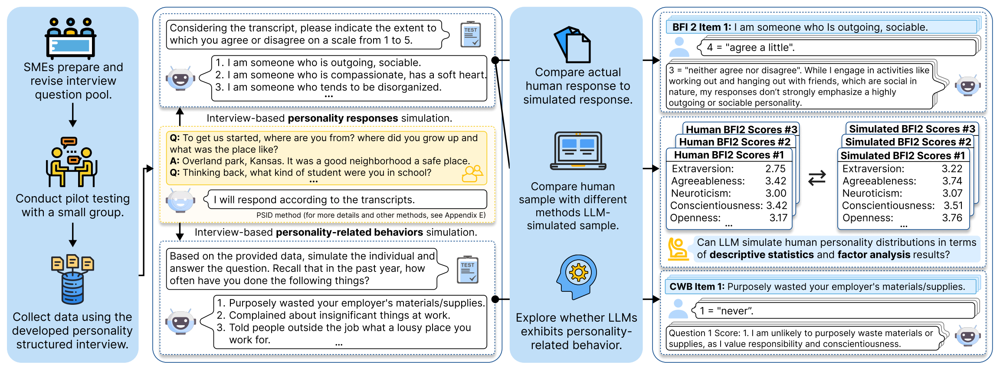

# Personality Structured Interview for Large Language Model Simulation in Personality Research



## Abstract

LLMs have recently been explored by psychometrics researchers as proxies for human participants. 
Although they show considerable potential in automating labor-intensive tasks and bridging AI research with psychological studies, these models often fail to generate heterogeneous data with human-like diversity, which diminishes their value in advancing social science research. 
To address this gap, we proposed a novel method to incorporate psychological insights into LLM simulation through the Personality Structured Interview (PSI). 
PSI leveraged psychometric scale-development procedures to capture personality-related linguistic information from a formal psychological perspective.
To systematically evaluate the simulation fidelity, we developed a measurement theory grounded evaluation procedure that considers the latent construct nature of personality and evaluates its reliability, structural validity, and external validity.
Results from three experiments demonstrate that PSI effectively improves human-like heterogeneity in LLM-simulated personality data and predicts personality-related behavioral outcomes.
We further develop a theoretical framework for designing theory-informed structured interviews to enhance the reliability and effectiveness of LLMs in simulating human-like data for broader psychometric research. 


## About
This branch contains following folders:
- `Experiment_One`: Analysis code for Experiment One (Response Similarity), assessing the similarity between responses generated by LLMs using the PSI method and actual human responses on personality scales. The goal is to determine how closely LLM-generated responses align with real human personality assessments.
- `Experiment_Two`: Analysis code for Experiment Two (Human Personality Distribution Simulation), comparing the PSI method with alternative approaches for modeling human personality distributions. This experiment examines how well different methods replicate the statistical properties of personality traits observed in real-world human samples.
- `Experiment_Three`: Analysis code for Experiment Three (Personality-Related Behavioral Performance), evaluating the ability of PSI-based models to simulate behaviors associated with different personality traits. This experiment tests whether the generated behaviors align with established psychological patterns in human personality research.
- `PSI_dataset.json`: The PSI dataset (already reverse-coded).


## PSI Questions

These questions were developed by adapting and modifying McAdams’s life history interview and narrative identity approach (McAdams, 1995, 1996, 2001), while also incorporating components from the Structured Interview of the Five-Factor Model (SIFFM; Trull et al., 1998).

| #  | **Questions** |
|----|-------------|
| 1  | To get us started, where are you from? Where did you grow up and what was the place like? |
| 2  | Thinking back, what kind of student were you in school? |
| 3  | Did you have a teacher or teachers that were influential? If so, why? What were they like? |
| 4  | What was your favorite subject in school, and why? |
| 5  | What was your least favorite subject in school, and why? |
| 6  | Still thinking back, who were your heroes when you were young and why? |
| 7  | When you were little, what did you want to be when you grew up? And why? |
| 8  | What were your dreams and plans when you graduated from high school? What made you have those dreams or plans? |
| 9  | If you had complete freedom, what would your dream job be, and why? |
| 10 | How have your dreams and goals changed throughout your life? |
| 11 | Shifting gears to your childhood, how would you describe the personalities of people in the family you grew up in? For example, what were your parents and/or siblings like? |
| 12 | How are you similar or different from your parents and/or siblings? |
| 13 | How do you think your similarities and/or differences influenced your relationship with them? |
| 14 | What was the best part of your childhood? |
| 15 | What do you think were the worst parts of your childhood? |
| 16 | Switching gears a little bit, what was your first paid job? How old were you then? (If this is not applicable to you, then please put `NA`.) |
| 17 | What other jobs have you had? (If this is not applicable to you, then please put `NA`.) |
| 18 | What do you do now for a living? And why did you choose it? |
| 19 | Please describe your typical work day. |
| 20 | What is the best and worst part of your current work? |
| 21 | Did you serve in the military? Please tell us about that experience, what was the best and worst part of it? |
| 22 | Moving on, what are your adult friendships like? |
| 23 | How are your adult friendships different from your childhood friendships? |
| 24 | What are your strongest qualities as a friend? In other words, what makes you a great friend to have? |
| 25 | What about your weakest qualities in friendships? In other words, what do you struggle with when you are trying to be a friend to someone? |
| 26 | Moving onto more general questions, when thinking about your life in general, what are you most proud of? |
| 27 | What hobbies or other interests do you have? |
| 28 | What things frighten you now? |
| 29 | What were some things that frightened you most as a child? |
| 30 | What are the three biggest news events that have occurred in your lifetime? |
| 31 | If you had the power to solve one and only one problem in the world, what would it be, and why? |
| 32 | Tell me about a time when you did not know if you would make it. How did you overcome that challenge? |


## PSI Dataset Structure
The PSI dataset consists of various demographic, behavioral, and personality-related variables. Below is a detailed description of the dataset structure:

### Demographic Variables
- **Gender**: The gender of the participant.
- **Race**: The racial background of the participant.
- **English**: Whether English is the participant’s first language.
- **Age**: The participant’s age.
- **Weight**: The participant’s weight.
- **Height**: The participant’s height.

### Personality Structured Interview Responses
- **Q1–Q32**: Participant responses to each personality structured interview question.

### Personality Trait Assessment
- **Item1–Item60**: Responses to each item of the Big Five Inventory-2 (BFI-2).

### Behavioral Measures
- **OCB1–OCB10**: Self-reported Organizational Citizenship Behavior data, measured using the scale from Spector (2010).
- **CWB1–CWB10**: Self-reported Counterproductive Work Behavior data, measured using the scale from Spector (2010).


## PSI Dataset Example

Here we presents an example of a PSI dataset.

<details>
 <summary>Click to open the example</summary>
<div style="max-height: 400px; overflow-y: auto; border: 1px solid #ccc; padding: 10px; background: #f9f9f9;">

```json
{
        "Gender":"Man",
        "Race":"White",
        "English":"Yes",
        "Age":18,
        "Weight":145.0,
        "Height":"5'7\"",
        "Q1":"I am from Wichita, Kansas I grew up on the west side of Wichita, I lived in a neighborhood right next to the elementary school I went to. It was fun, I had good friends that lived in the neighborhood and surrounding ones.",
        "Q2":"I was a smart kid in school always getting good grades, but I would also try to be the class clown",
        "Q3":"I had one specific teacher that was pretty influential to me. His name is Casey Meier and I had his history class for my last two years of high school. He was influential because he always seemed to care about me and my well being. I also thought that he was just a really good guy and respected him which lead to him having influence on me. He was funny, smart, understanding, and he just felt like another friend at school and not a teacher.",
        "Q4":"My favorite subject in school was always math because it was so easy for me to understand. That was until I got into calculus and more advanced math and my skills fell off making math more frustrating.",
        "Q5":"My least favorite subject was the sciences like biology, chemistry, and physics.",
        "Q6":"I do not really think I had a traditional hero growing up, some of the people I really looked up to and consumed on social media were stand up comedians. My favorites were Jim Jefferies and Joey Diaz.  They were my heroes because they made me laugh and I would watch their stories and comedy specials because I wanted to be more funny as an individual.",
        "Q7":"I did not know what I wanted to be when I grew up, but I knew what I wanted to do, and that was play video games. but now that I have things more figured out I found out I want to be a streamer. I want to be a video game streamer because I could do what I love for a living.",
        "Q8":"My dreams were to go become a pilot in college and also make it big on Twitch. I am currently becoming a private pilot in college so that is going well. I stream occasionally on twitch, but have not developed any real viewers yet.",
        "Q9":"I would be a Twitch streamer. I would do this because I could play video games and just try to be funny and laugh while having an audience.",
        "Q10":"I once dreamed of living a simply life and working a 9-5. Now I dream of just being successful and finding a person I want to spend my life with. I also just want to be happy and accomplish my career goals.",
        "Q11":"My dad and my younger brother are pretty similar, they are both quiet, nerdy, and smart. My older brother is outgoing and loves to talk and is not afraid to be himself. My sister is very smart and respectable and I love talking to her about things. My mom was always been a decent mom but she is also a narcissist and manipulative.",
        "Q12":"Comparing myself to my sister I think we are similar in that we have high standards for ourselves and both aim to be successful. We both went through some of the same things through high school so we enjoy the presence of each other and kind of relate to each other pretty well.",
        "Q13":"We used to be very different from each other and would fight. And then we both matured and came around to each other and our relationship has been nothing but fun.",
        "Q14":"The best part was not having any stress over the things you think about as an adult. It is like your living in a pure moment all the time and nothing matters except that moment.",
        "Q15":"The worst parts of my childhood was when I got scammed out of some money, and various moments where my mom was verbally abusive and uncaring.",
        "Q16":"My first paid job was at McAlister's Deli, I was 16 years old back then.",
        "Q17":"I also worked at Panera Bread, and I am currently working at an on campus gym at college.",
        "Q18":"I work at a gym for my college. I don't make much money but it is good time to get my homework done for school while also earning a little bit of money.",
        "Q19":" My typical day consists of waking up and going to class, hitting the gym, going to work, and then spending the rest of my time playing video games at the end of the day.",
        "Q20":"The environment is fun and the people I work with have become good friends. The worst part of my current work is that I only get paid 9.25 an hour.",
        "Q21":"I didn't serve in the military.",
        "Q22":"Some of my friends I mostly talk to online and joke and play video games with them. The in person friends I have I work with and will occasionally go out or play games with them.",
        "Q23":"Adult friendships consist more of going out and spending money. Rather than childhood friendships where you would do random things since you didn't have a job.",
        "Q24":"My greatest quality as a friend would be cracking jokes, I never takes things very seriously and there is always room for a little laugh.",
        "Q25":"I struggle with initiating hangouts or making friends with people I am not very familiar with and that I have only started becoming friends with.",
        "Q26":"I am most proud of the person I have become over the years. A more materialistic answer is that I won a state championship for hurdles my junior year of high school.",
        "Q27":"My hobbies are video games, working out and hanging out with my friends. hangout-w-friends",
        "Q28":" Being lonely frightens me, I am scared my inability to make friends and be outgoing will impact me when my childhood friends move on from playing videogames everyday and I will have to find new friends who might not be as good.",
        "Q29":"I can't think of anything that really frightened me as a child.",
        "Q30":"The covid 19 pandemic. The ukraine and russian war. And also my grandmother dying.",
        "Q31":"I would solve the problem of scarcity. So we could live out our lives comfortably and healthily without need for war and working, people would just follow their interests.",
        "Q32":"I had exams at the end of my high school career that I had to pass to receive a special diploma and also receive college credits. I overcame that challenge and uncertainty by taking mock exams and increasing my confidence that I would do good.",
        "Item1":3,
        "Item2":2,
        "Item3":5,
        "Item4":2,
        "Item5":4,
        "Item6":5,
        "Item7":2,
        "Item8":4,
        "Item9":4,
        "Item10":5,
        "Item11":5,
        "Item12":4,
        "Item13":4,
        "Item14":4,
        "Item15":4,
        "Item16":4,
        "Item17":5,
        "Item18":5,
        "Item19":5,
        "Item20":5,
        "Item21":2,
        "Item22":3,
        "Item23":5,
        "Item24":4,
        "Item25":3,
        "Item26":4,
        "Item27":5,
        "Item28":4,
        "Item29":2,
        "Item30":4,
        "Item31":4,
        "Item32":4,
        "Item33":5,
        "Item34":4,
        "Item35":3,
        "Item36":4,
        "Item37":1,
        "Item38":1,
        "Item39":1,
        "Item40":2,
        "Item41":1,
        "Item42":1,
        "Item43":1,
        "Item44":1,
        "Item45":1,
        "Item46":1,
        "Item47":1,
        "Item48":1,
        "Item49":5,
        "Item50":5,
        "Item51":5,
        "Item52":5,
        "Item53":5,
        "Item54":5,
        "Item55":3,
        "Item56":4,
        "Item57":5,
        "Item58":2,
        "Item59":5,
        "Item60":5,
        "OCB1":3,
        "OCB2":3,
        "OCB3":3,
        "OCB4":2,
        "OCB5":2,
        "OCB6":3,
        "OCB7":2,
        "OCB8":4,
        "OCB9":1,
        "OCB10":3,
        "CWB1":1,
        "CWB2":3,
        "CWB3":1,
        "CWB4":1,
        "CWB5":2,
        "CWB6":1,
        "CWB7":2,
        "CWB8":2,
        "CWB9":1,
        "CWB10":2
    }
```
</div>

</details>


## BibTex
```

```